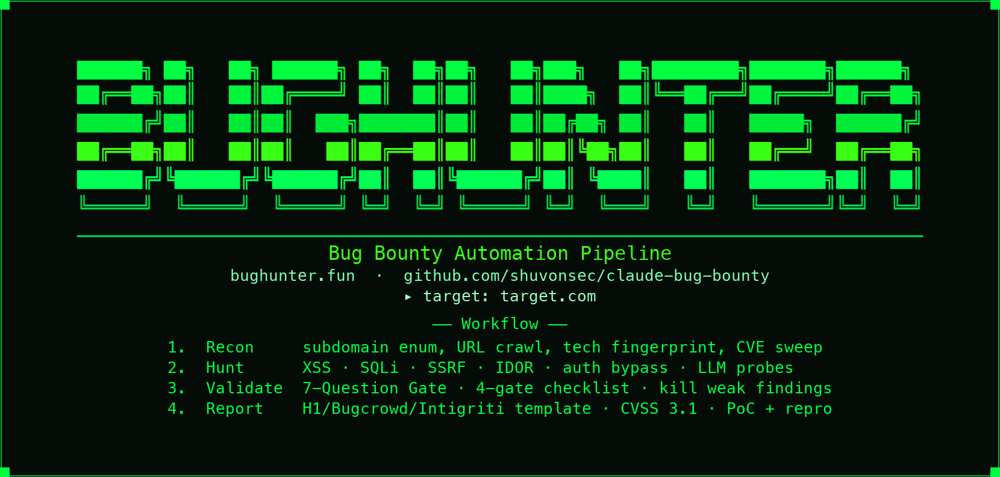

<p align="center">
  
</p>

<h1 align="center">BugHunter</h1>

<p align="center">
  <b>AI-powered bug bounty hunting — recon to report, in your terminal.</b><br>
  <a href="#standalone-mode--no-subscription-required">Free Setup</a>
  ·
  <a href="#quick-start">Quick Start</a>
  ·
  <a href="#commands">Commands</a>
  ·
  <a href="#what-it-finds">What It Finds</a>
  ·
  <a href="#installation">Install</a>
  ·
  <a href="FAQ.md">FAQ</a>
</p>

<p align="center">
  <a href="https://github.com/shuvonsec/claude-bug-bounty/blob/main/LICENSE"></a>
  
  
  <a href="https://claude.ai/claude-code"></a>
  <a href="https://github.com/shuvonsec/claude-bug-bounty/stargazers"></a>
</p>

<p align="center">
  
</p>

---

## What Is This?

A professional bug bounty hunting toolkit that works **with or without a Claude subscription**. Give it a target — it handles recon, tests for vulnerabilities, validates findings through a strict gate, and writes submission-ready reports for HackerOne, Bugcrowd, Intigriti, and Immunefi.

**It remembers everything.** Patterns found on one target inform the next. Sessions pick up where they left off.

Works as a [Claude Code](https://claude.ai/claude-code) plugin **or** as a fully standalone CLI (`bughunter`) powered by free AI providers.

---

## Standalone Mode — No Subscription Required

**You no longer need Claude Code, Claude Pro, or any paid AI subscription.**

Install once, use the `bughunter` command from any terminal on your machine:

```bash
git clone https://github.com/shuvonsec/claude-bug-bounty.git
cd claude-bug-bounty
./install.sh --agent standalone
```

Rerun the same command after pulling updates. The installer detects and
refreshes the active managed `bughunter` command, including older installations
under `/usr/local/bin` or `~/.local/bin`, while preserving your saved provider
configuration in `~/.bughunter/config.json`.

To uninstall the standalone command while keeping its configuration:

```bash
./uninstall.sh --agent standalone
```

Use `--purge-config` to also delete `~/.bughunter/config.json`. The uninstaller
also supports `claude`, `opencode`, `pi`, `codex`, `agents`, and `all` targets.

```
bughunter help               # show every command
bughunter setup              # choose your AI provider (Ollama is free + offline)
bughunter recon target.com   # map the attack surface
bughunter hunt  target.com   # hunt for vulnerabilities
bughunter validate "finding" # 7-Question Gate on your finding
bughunter report             # write a submission-ready report
bughunter chat               # interactive AI hunting shell
bughunter providers          # list all available AI providers
bughunter models             # list models and show the selected one
bughunter status             # check which provider is active
bughunter h target.com       # short alias for hunt
bughunter r target.com       # short alias for recon
bughunter v "finding"        # short alias for validate
```

### Free AI Providers (auto-detected, free-first priority)

| Provider | Cost | Privacy | Speed | Get Started |
|:---|:---|:---|:---|:---|
| **Ollama** | 100% free · runs locally | Full — stays on your machine | Fast | `ollama pull qwen2.5:14b` |
| **Groq** | Free tier available | Cloud | Very fast | [console.groq.com](https://console.groq.com) → get API key |
| **DeepSeek** | Very cheap (v4-flash / v4-pro) | Cloud | Fast | [platform.deepseek.com](https://platform.deepseek.com) |
| Claude API | Paid | Cloud | Fast | [console.anthropic.com](https://console.anthropic.com) |
| OpenAI | Paid | Cloud | Fast | [platform.openai.com](https://platform.openai.com) |
| **Grok (xAI)** | Paid | Cloud | Fast | [console.x.ai](https://console.x.ai) → `grok-4.5` |
| **OpenRouter** | Subscription / pay-as-you-go | Cloud | Fast | [openrouter.ai/keys](https://openrouter.ai/keys) → get API key |

BugHunter auto-detects providers in this order: **Ollama → Groq → DeepSeek → … → OpenRouter → Claude → OpenAI**

Switch providers or choose an installed Ollama model anytime: `bughunter setup`.
The setup can also be fully non-interactive:

```bash
bughunter setup --provider ollama --model qwen2.5:14b
```

For a one-off override, put the option before the command:

```bash
bughunter --provider ollama --model qwen3:14b hunt target.com
```

### Zero-cost fully offline setup

```bash
# 1. Install Ollama (runs AI locally, no internet needed after download)
curl -fsSL https://ollama.ai/install.sh | sh
ollama pull qwen2.5:14b          # ~9 GB, one-time download

# 2. Install BugHunter
git clone https://github.com/shuvonsec/claude-bug-bounty.git
cd claude-bug-bounty
./install.sh --agent standalone   # creates system-wide 'bughunter' command

# 3. Hunt
bughunter setup       # choose Ollama, then choose one of its installed models
bughunter recon target.com
```

### Groq setup (free cloud, fastest option)

```bash
export GROQ_API_KEY="your-key-here"     # free at console.groq.com
./install.sh --agent standalone
bughunter setup       # choose Groq
bughunter hunt target.com
```

---

## Quick Start

**Option A — standalone (no subscription, works for everyone)**

```bash
git clone https://github.com/shuvonsec/claude-bug-bounty.git
cd claude-bug-bounty
./install.sh --agent standalone   # creates system-wide 'bughunter' command
bughunter setup                   # pick a free AI provider
bughunter recon target.com
bughunter hunt  target.com
bughunter validate "my finding"
bughunter report
```

**Option B — Claude Code plugin** *(requires Claude Code)*

```bash
git clone https://github.com/shuvonsec/claude-bug-bounty.git
cd claude-bug-bounty
chmod +x install_tools.sh && ./install_tools.sh   # subfinder · httpx · nuclei · katana · ffuf
chmod +x install.sh      && ./install.sh          # skills + commands → ~/.claude/
```

```bash
claude
/recon target.com        # map the attack surface
/hunt target.com         # test for vulnerabilities
/validate                # run the 7-Question Gate
/report                  # write the submission
```

**Option C — let Claude install it** *(Claude Code only)*

Open your terminal, run `claude`, then paste:

```text
Install the Claude Bug Bounty toolkit from https://github.com/shuvonsec/claude-bug-bounty
into ~/tools/. Clone the repo, run ./install_tools.sh then ./install.sh.
Verify /recon /hunt /validate /report are available.
```

---

## Commands

### Core Workflow

| Command | What It Does |
|:---|:---|
| `/recon target.com` | Subdomain enum · live host probing · URL crawl · nuclei sweep |
| `/hunt target.com` | Tests IDOR · auth bypass · SSRF · XSS · SQLi · logic flaws and more |
| `/validate` | 7-Question Gate — kills weak findings before you waste time reporting |
| `/report` | Generates an H1 · Bugcrowd · Intigriti · Immunefi submission in 60s |
| `/autopilot target.com` | Full loop, autonomous — scope → recon → hunt → validate → report |

### Recon & Enumeration

| Command | What It Does |
|:---|:---|
| `/surface target.com` | Ranked attack surface from recon data + memory |
| `/scope-aggregate <program>` | All in-scope assets across H1 · Bugcrowd · Intigriti · YWH · Immunefi |
| `/cloud-recon --keyword <name>` | Public S3 · Azure · GCP buckets + CloudFlare-bypass origin IPs |
| `/param-discover <url>` | Hidden HTTP parameters via Arjun · x8 |
| `/secrets-hunt --js-bundle <dir>` | Leaked credentials in source, JS bundles, or a GitHub org |
| `/takeover --recon <dir>` | Subdomain takeover candidates via dnsReaper · subjack |
| `/scan-cves <host>` | Focused nuclei high/critical sweep + optional log4j-scan |
| `/bypass-403 <url>` | Header · method · encoding tricks against 403/401 |


### Scanners (Web + LLM)

| Command | What It Does |
|:---|:---|
| `/cors <url>` | CORS misconfig — origin reflection · null · credentialed |
| `/crlf <url>` | CRLF / response-splitting + host-header injection |
| `/nosqli <url>` | NoSQL injection (operator bypass · `$where` timing) |
| `/jwt-scan <token>` | Offline JWT toolkit — alg:none · RS256→HS256 · secret crack |
| `/oob <target>` | Out-of-band listener (interactsh) for blind SSRF/XXE/SQLi |
| `/llm-redteam <endpoint>` | LLM red-team corpus — prompt injection · jailbreak · exfil |

### Smart Contract (Web3)

| Command | What It Does |
|:---|:---|
| `/web3-audit <contract.sol>` | 10-class smart contract audit with Foundry PoC template |
| `/token-scan <contract>` | Rug pull scanner — mint authority · LP lock · honeypot · bonding curve |

### Session & Utility

| Command | What It Does |
|:---|:---|
| `/pickup target.com` | Resume from last session — untested endpoints first |
| `/intel target.com` | CVEs + disclosed reports relevant to this target |
| `/chain` | Bug A found → finds bugs B and C that chain with it |
| `/scope <asset>` | Checks if a domain or URL is in scope before you test it |
| `/triage` | Quick 2-minute go/no-go check |
| `/remember` | Logs the current finding or technique to hunt memory |
| `/memory-gc` | Inspect or rotate hunt-memory JSONL files (10 MB cap, 3 backups) |
| `/arsenal [tool]` | Lists installed external tools or prints an install hint |

---

## What It Finds

<details>
<summary><b>26 Web2 Vulnerability Classes</b></summary>
<br>

| Vulnerability | Typical Payout |
|:---|:---|
| IDOR / BOLA | $500 – $5K |
| Auth Bypass | $1K – $10K |
| XSS (Stored / Reflected / DOM) | $500 – $5K |
| SSRF | $1K – $15K |
| Business Logic | $500 – $10K |
| Race Conditions | $500 – $5K |
| SQL Injection | $1K – $15K |
| OAuth / OIDC | $500 – $5K |
| File Upload → RCE | $500 – $10K |
| GraphQL Auth Bypass | $1K – $10K |
| LLM / Prompt Injection | $500 – $10K |
| API Misconfiguration (mass assignment · JWT · CORS) | $500 – $5K |
| Account Takeover | $1K – $20K |
| SSTI | $2K – $10K |
| Subdomain Takeover | $200 – $5K |
| Cloud / Infra Exposure | $500 – $20K |
| HTTP Request Smuggling | $5K – $30K |
| Cache Poisoning | $1K – $10K |
| MFA / 2FA Bypass | $1K – $10K |
| SAML / SSO Attack | $2K – $20K |
| Error Disclosure / Debug Endpoints | $200 – $5K |
| CSS Injection | $500 – $5K |
| LFI → RCE | $1K – $15K |
| Insecure Deserialization | $5K – $30K |
| Dependency Confusion / Supply Chain | $1K – $20K |
| Padding Oracle / Crypto Misuse | $2K – $20K |

</details>

<details>
<summary><b>10 Web3 / Smart Contract Bug Classes</b></summary>
<br>

| Vulnerability | Typical Payout |
|:---|:---|
| Accounting Desync | $50K – $2M |
| Access Control | $50K – $2M |
| Incomplete Code Path | $50K – $2M |
| Off-By-One | $10K – $100K |
| Oracle Manipulation | $100K – $2M |
| ERC4626 Share Inflation | $50K – $500K |
| Reentrancy | $10K – $500K |
| Flash Loan Attack | $100K – $2M |
| Signature Replay | $10K – $200K |
| Proxy / Upgrade | $50K – $2M |

</details>

---

## AI Agents

Nine specialists, each built for one job:

| Agent | Role |
|:---|:---|
| `recon-agent` | Subdomain enum · live host discovery · URL crawl |
| `report-writer` | Impact-first reports that get paid, not N/A'd |
| `validator` | Runs the 7-Question Gate — kills weak findings |
| `web3-auditor` | Smart contract audit across 10 bug classes |
| `chain-builder` | Bug A → finds bugs B and C that chain with it |
| `autopilot` | Full hunt loop with safety checkpoints |
| `recon-ranker` | Ranks attack surface by highest-value targets first |
| `token-auditor` | Meme coin / token rug pull and security scan |
| `credential-hunter` | Wordlist gen → OSINT → breach-check → spray (hard-stop before spray) |

---

## How It Works

<div align="center">

```
   You ─▶ /recon ─▶ /hunt ─▶ /validate ─▶ /report
              │                  │
              ▼                  ▼
        Hunt Memory       7-Question Gate
   (persists across    (kills weak findings
       sessions)         before you submit)
```

</div>

Every tool in the pipeline is gated on whether it's installed — missing tools are skipped, not errors. Auth headers set once carry through httpx · katana · ffuf · nuclei · dalfox automatically.

---

## Project Structure

<details>
<summary><b>Click to expand the full tree</b></summary>
<br>

```
claude-bug-bounty/
│
├── skills/                    # AI knowledge bases — loaded as /skill-name
│   ├── bug-bounty/            # Master workflow — all vuln classes, LLM testing, chains
│   ├── bb-methodology/        # Hunting mindset · 5-phase workflow · session discipline
│   ├── web2-recon/            # Subdomain enum · live host discovery · URL crawl
│   ├── web2-vuln-classes/     # 26 bug classes with bypass tables
│   ├── security-arsenal/      # Payloads · bypass tables · gf patterns
│   ├── triage-validation/     # 7-Question Gate · 4 gates · never-submit list
│   ├── report-writing/        # Templates for H1 · Bugcrowd · Intigriti · Immunefi
│   ├── web3-audit/            # Smart contract bugs · Foundry PoC · 10 bug classes
│   ├── meme-coin-audit/       # Rug pull detection · LP attacks · bonding curve
│   ├── credential-attack/     # Password spray methodology · legal guardrails
│   └── client-reverse/        # Request-signing / anti-bot token reversal
│
├── commands/                  # 26 slash commands (/recon /hunt /validate /report …)
├── agents/                    # 9 specialized AI agents (recon, validator, reporter …)
│
├── tools/                     # Python + shell scanner pipeline (~35 tools)
│   ├── hunt.py                # Master orchestrator
│   ├── recon_engine.sh        # Subdomain + URL discovery
│   ├── vuln_scanner.sh        # XSS · SQLi · SSRF · SSTI probe pipeline
│   ├── validate.py            # 4-gate finding validator with identity checks
│   └── …                      # 30+ more scanners — see tools/README.md
│
├── memory/                    # Cross-session hunt memory (pattern DB · audit log)
├── rules/                     # Always-active hunting + reporting rules
├── tests/                     # Regression test suite (pytest)
├── web3/                      # 13-chapter smart contract audit guide
├── mcp/                       # MCP integrations — Burp Suite · Caido · HackerOne API
├── wordlists/                 # Curated wordlists + SecLists / PayloadsAllTheThings refs
├── scripts/                   # Dork runner · full hunt pipeline
├── hooks/                     # Claude Code hook configuration
├── site/                      # bughunter.fun landing page
├── demo/                      # Local vulnerable target for tutorial recordings
│
├── docs/                      # Extended documentation
│   ├── advanced-techniques.md # Exploitation techniques + chaining strategies
│   ├── auth-sessions.md       # Auth header management guide
│   ├── payloads.md            # Payload reference for common vuln classes
│   ├── smart-contract-audit.md# Smart contract audit deep-dive
│   ├── TUTORIAL.md            # A→Z video tutorial walkthrough
│   └── TODOS.md               # Open improvement items
│
├── .github/                   # GitHub community health files
│   ├── CONTRIBUTING.md        # How to contribute
│   ├── CODE_OF_CONDUCT.md     # Community standards
│   ├── SECURITY.md            # Vulnerability reporting policy
│   ├── PULL_REQUEST_TEMPLATE.md
│   └── ISSUE_TEMPLATE/        # Bug report · Feature request · False positive
│
├── engine.py                  # Standalone CLI — 'bughunter' command, no subscription needed
├── brain.py                   # Multi-provider LLM layer (Ollama · Groq · DeepSeek · Claude · OpenAI)
├── agent.py                   # LangGraph-style ReAct hunting agent
├── install.sh                 # Install skills + commands → ~/.claude/ (or standalone mode)
├── install_tools.sh           # Install subfinder · httpx · nuclei · katana · ffuf …
├── uninstall.sh               # Remove skills + commands from ~/.claude/
├── uninstall_tools.sh         # Remove external scanning tools
├── serve.py                   # Launch local demo target (python3 serve.py)
├── config.example.json        # Auth session config template
├── requirements.txt           # Python dependencies
├── CLAUDE.md                  # Claude Code plugin manifest (auto-loaded)
├── AGENTS.md                  # Multi-harness plugin guide (OpenCode · Codex · Pi)
├── SKILL.md                   # Master skill shortcut (auto-loaded by agent harnesses)
├── OPENCODE.md                # OpenCode-specific installation guide
├── CHANGELOG.md               # Version history
├── FAQ.md                     # Frequently asked questions
└── TERMS.md                   # Terms of use + authorized testing only
```

</details>

---

## Installation

**Prerequisites:**

```bash
# macOS
brew install go python3 jq

# Linux (Ubuntu/Debian)
sudo apt install golang python3 jq
```

**Scanning tools** (installs subfinder · httpx · nuclei · katana · ffuf · gau · dnsx · nmap · dalfox and more):

```bash
chmod +x install_tools.sh && ./install_tools.sh
```

**Standalone `bughunter` command** (no subscription, works without Claude Code):

```bash
./install.sh --agent standalone
bughunter setup    # choose Ollama (free) · Groq (free tier) · DeepSeek (cheap) · Claude · OpenAI
```

**AI skills + commands** into Claude Code:

```bash
chmod +x install.sh && ./install.sh
```

**Other agent harnesses:**

```bash
./install.sh --agent opencode    # OpenCode
./install.sh --agent pi          # Pi Agent
./install.sh --agent codex       # Codex
./install.sh --agent all         # every supported target
```

**Optional: Chaos API key** (better subdomain coverage)

```bash
export CHAOS_API_KEY="your-key"
echo 'export CHAOS_API_KEY="your-key"' >> ~/.zshrc
```

---

## Rules

Seven rules run every session, no exceptions:

| # | Rule | Why |
|:-:|:---|:---|
| 1 | **Read full scope first** | Only test what the program authorizes |
| 2 | **Real bugs only** | "Can an attacker do this RIGHT NOW?" — if no, stop |
| 3 | **Kill weak findings** | A 30-second check saves hours of wasted reporting |
| 4 | **Never go out of scope** | One wrong request can get you banned |
| 5 | **5-minute rule** | No progress after 5 minutes? Move on |
| 6 | **Validate before report** | `/validate` before spending 30 minutes writing |
| 7 | **Impact first** | Test the bugs with the worst consequences first |

---

## Contributing

PRs welcome. Most valuable:
- New scanner modules or detection techniques
- Payload additions to `skills/security-arsenal/SKILL.md`
- Methodology improvements backed by paid reports
- Platform support (YesWeHack · Synack · HackenProof)

```bash
git checkout -b feature/your-contribution
git commit -m "feat: short description"
git push origin feature/your-contribution
```

---

## Star History

<p align="center">
  <a href="https://www.star-history.com/?repos=shuvonsec%2Fclaude-bug-bounty&type=date&legend=top-left">
    <picture>
      <source media="(prefers-color-scheme: dark)" srcset="https://api.star-history.com/chart?repos=shuvonsec/claude-bug-bounty&type=date&theme=dark&legend=top-left" />
      <source media="(prefers-color-scheme: light)" srcset="https://api.star-history.com/chart?repos=shuvonsec/claude-bug-bounty&type=date&legend=top-left" />
      
    </picture>
  </a>
</p>

---

## Support

If BugHunter helps your hunts, you can fuel more of them:

<p align="center">
  <a href="https://www.buymeacoffee.com/shuvonsec">
    
  </a>
</p>

---

## Thanks

Thanks to everyone who has contributed to BugHunter. Click any avatar to open their GitHub profile.

<p align="center">
  <a href="https://github.com/shuvonsec"></a>&nbsp;
  <a href="https://github.com/shuv0n"></a>&nbsp;
  <a href="https://github.com/letztek"></a>&nbsp;
  <a href="https://github.com/bertolikimberly"></a>&nbsp;
  <a href="https://github.com/venkatas"></a>&nbsp;
  <a href="https://github.com/adityaax"></a>&nbsp;
  <a href="https://github.com/BeargleIndustries"></a>&nbsp;
  <a href="https://github.com/ultra-supara"></a>&nbsp;
  <a href="https://github.com/AurisDSP"></a>&nbsp;
  <a href="https://github.com/Edneam"></a>&nbsp;
  <a href="https://github.com/depapp"></a>&nbsp;
  <a href="https://github.com/Realgagenichols"></a>&nbsp;
  <a href="https://github.com/thuvh"></a>&nbsp;
  <a href="https://github.com/onlybugs05"></a>&nbsp;
  <a href="https://github.com/savioruz"></a>&nbsp;
  <a href="https://github.com/Paebak"></a>&nbsp;
  <a href="https://github.com/nurazhardotcom"></a>&nbsp;
  <a href="https://github.com/SeekAndExploit"></a>&nbsp;
  <a href="https://github.com/Shawanga"></a>&nbsp;
  <a href="https://github.com/zeze-zeze"></a>&nbsp;
  <a href="https://github.com/grave0x"></a>&nbsp;
  <a href="https://github.com/kevinaimonster"></a>
</p>

---

<p align="center">
  <br>
  <a href="https://github.com/shuvonsec">GitHub</a>
  ·
  <a href="https://x.com/shuvonsec">Twitter</a>
  ·
  <a href="mailto:shuvonsec@gmail.com">shuvonsec@gmail.com</a><br>
  <b>Built by bug hunters, for bug hunters.</b><br>
  <sub>MIT License · For authorized security testing only. Always test within an approved bug bounty program scope.</sub>
</p>
